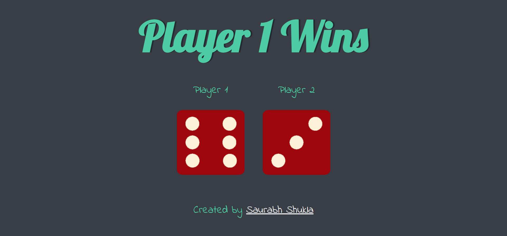

#  The Dicee Game

Dicee Game is a simple game where two players can play with each other. The game is built using HTML, CSS and Javascript. The game is fully responsive and works on all devices.

## Table of contents

- [Overview](#overview)
  - [About Dicee Game](#about-dicee-game)
  - [Screenshot](#screenshot)
  - [Links](#links)
- [My process](#my-process)
  - [Built with](#built-with)
  - [What I learned](#what-i-learned)
  - [Continued development](#continued-development)
  - [Useful resources](#useful-resources)
- [Author](#author)
- [Acknowledgments](#acknowledgments)


## Overview

### About Dicee Game

Dicee Game is a simple game where two players can play with each other. The game is built using HTML, CSS and Javascript. The game is fully responsive and works on all devices.

### Screenshot




### Links


- Live Site URL: [Github Pages](https://saurabh13042004.github.io/The-Dicee-Game/)


## My process

### Built with

- HTML5
- CSS3
- Javascript


### What I learned

I have learned a lot of things while making this project. I have learned to implement various DOM properties of Javascript .

Some code snippet for fun 😀:

```html
<h1>Let's Settle Dispute with Dicee Game</h1>
```
```css
.proud-of-this-game {
  color: red;
}
```
```js
const learning = () => {
  console.log('🎲')
}
```


### Continued development

I want to improve my Javascript skills and I will be working on it. I will be making more projects using Javascript and will be improving my skills.


## Author

- Github Profile Link - [Saurabh13042004](https://github.com/Saurabh13042004)
- Linkdin - [@saurabh-shukla](https://www.linkedin.com/in/saurabh-shukla-0b45b3224/)
- Instagram - [@saurabh._shukla._](https://www.instragram.com/saurabh._shukla._ )


## Acknowledgments


I would like to thank Angela Yu for making such a great course. I have learned a lot from her. 

Thanks for reading this far, if you have any suggestions or feedback, please let me know. I would love to hear from you.
